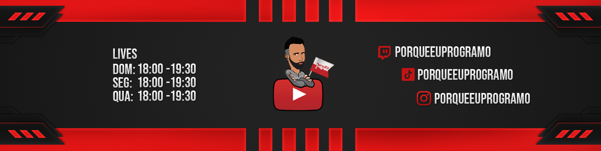

</img>

👨‍💻 Backend Developer / DevOps

🚀 About Me 
Hello, I'm Tiago, I'm the face of this channel PorqueEUProgramo.
I consider myself a social person, always waiting for a joke, and in other hand I know how to be professional and responsible, obstinated for my goals.

⚙️ Technical Skills 
Backend: JAVA, MAVEN, SPRING BOOT 
Cloud: AWS (ECS, EKS, LAMBDA, SNS, RDS, S3...) 
CICD: Jenkins, GitHub Actions 
Database: PostgreSQL, DynamoDB 
Agile: Scrum

💼 Professional Opportunities 
I am looking for challenges and opportunities that makes me feel on a continous learning.

📧 About PorqueEUProgramo 
PorqueEUProgramo is a programming and software development community in Portugal.  

🟪Lives on Twitch: 
Sunday: 22:00 - 23:30 
Wednesday: 22:00 - 23:30 

&nbsp;&nbsp;&nbsp;&nbsp;
&nbsp;&nbsp;&nbsp;&nbsp;
&nbsp;&nbsp;&nbsp;&nbsp; 
&nbsp;&nbsp;&nbsp;&nbsp;&nbsp;&nbsp;&nbsp;&nbsp;&nbsp;&nbsp;&nbsp;&nbsp;&nbsp;&nbsp;&nbsp;&nbsp;&nbsp;&nbsp;&nbsp;&nbsp;

<b>💻 Technologies</b>

  
  
  
  
  
  

  
  
  
  
  
  
  

  

  
  

