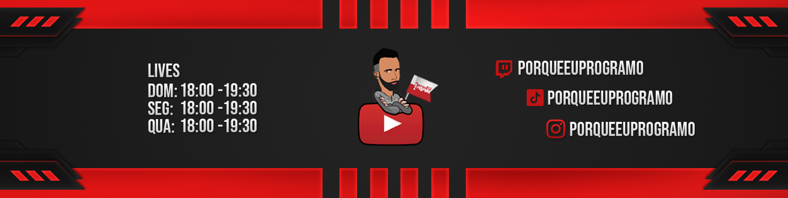

</img>

👨‍💻 Backend Developer / DevOps Engineer 
Java · AWS · Kubernetes · Kafka · AI 
 
🚀 ABOUT ME 
Hello, I’m Tiago, a Backend Developer and DevOps Engineer based in Porto, Portugal. 
 
I enjoy solving problems, teamwork and development, with a professional approach. 
 
At Critical TechWorks, I have contributed to autonomous driving and global electric vehicle charging projects, delivering Java microservices, AWS infrastructure, data pipelines and Kafka services. 
 
My experience includes migrating monolithic applications to microservices, moving projects from Amazon ECS to Kubernetes on EKS, and adapting CI/CD pipelines for Kubernetes deployments. 
 
With eight years of experience in teams providing 24/7 on-call support, I bring an operational mindset focused on proactive monitoring, incident response and infrastructure cost optimization. 
 
🤖 AI-ASSISTED ENGINEERING 
I use Model Context Protocol (MCP) to connect agents to tools and project context. 
 
I create reusable skills and specialized agents to support development, troubleshooting and recurring engineering tasks. 
 
⚙️ TECHNICAL SKILLS 
• Backend: Java, Spring Boot, Maven, Scala 
• Frontend: React 
• Data Streaming: Apache Kafka, data processing and enrichment 
• Cloud: AWS — ECS, EKS, Lambda, SNS, RDS, S3 
• Containers &amp; Orchestration: Kubernetes 
• Infrastructure as Code: Terraform 
• CI/CD: Jenkins, GitHub Actions 
• Databases: PostgreSQL, DynamoDB 
• Observability: CloudWatch, Prometheus, Grafana 
• AI: MCP, skills, agents 
• Version Control &amp; Security: Git, GitHub, Keycloak 
• Agile: Scrum, Kanban 
• Operations: 24/7 on-call support, incident response, preventive analysis and cost optimization 
 
🛍️ E-COMMERCE &amp; DIGITAL MARKETING 
Alongside my engineering career, I build Shopify fashion stores targeting Romania, Serbia and Lithuania, combining development, marketing and business analysis. 
 
My experience includes Meta Ads, advertising creatives, conversion optimization and automated abandoned-cart and checkout recovery flows. 
 
I developed a Shopify cart customization plugin, a store-performance analytics tool and a WinningHunter-based tool for product validation and competitor research. 
 
I also created an AI agent to automate Shopify store creation, order and product management, and conversion-data analysis. 
 
🌍 PERSONAL PROJECTS 
I’m the founder of PorqueEUProgramo, a Portuguese community for sharing programming knowledge. 

 
💼 PROFESSIONAL INTERESTS 
Backend development, cloud infrastructure, data streaming, DevOps and AI-assisted engineering.

⬛ GitHub: [https://github.com/porqueeuprogramo](https://github.com/porqueeuprogramo) 
🟪 Twitch: [https://www.twitch.tv/porqueeuprogramo](https://www.twitch.tv/porqueeuprogramo) 
🟥 YouTube: [https://www.youtube.com/porqueeuprogramo](https://www.youtube.com/porqueeuprogramo) 

&nbsp;&nbsp;&nbsp;&nbsp;
&nbsp;&nbsp;&nbsp;&nbsp;
&nbsp;&nbsp;&nbsp;&nbsp; 
&nbsp;&nbsp;&nbsp;&nbsp;&nbsp;&nbsp;&nbsp;&nbsp;&nbsp;&nbsp;&nbsp;&nbsp;&nbsp;&nbsp;&nbsp;&nbsp;&nbsp;&nbsp;&nbsp;&nbsp;

<b>💻 Technologies</b>

  
  
  
  
  
  

  
  
  
  
  
  
  

  

  
  

